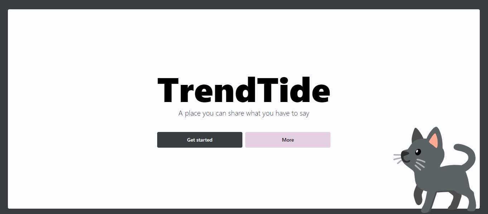

# trend-tide

A place to post some ideas build with React.js



**Warning** 🚧 Under construction

## Features

- [ ] Search
- [x] Favorite and unfavorite posts
- [x] Enlarge post image

## Tools


## Project Setup

```sh
npm install
```

### Compile and Hot-Reload for Development

```sh
npm run dev
```

### Compile and Minify for Production

```sh
npm run build
```

## License

[MIT](./License.md)
